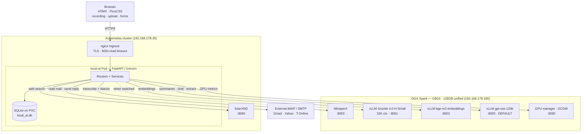
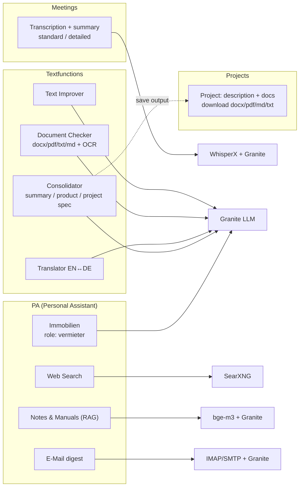
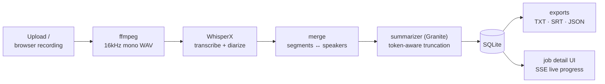

# Architecture & Code Guide

## Project Structure

```
local-ai-app/
├── pyproject.toml                    # Package metadata + dependencies
├── requirements-remote.txt           # Slim deps for K8s (no torch/pyannote)
├── Dockerfile                        # Production image (remote-backend only)
├── .env.example                      # Configuration template
├── k8s/                              # Kubernetes manifests
│   ├── namespace.yaml
│   ├── configmap.yaml                # All LOCAL_AI_* env vars
│   ├── deployment.yaml               # Single-replica pod
│   ├── service.yaml                  # ClusterIP on port 80
│   ├── ingress.yaml                  # nginx ingress with upload tuning
│   └── pvc.yaml                      # Persistent storage for SQLite + uploads
├── src/local-ai/
│   ├── __init__.py
│   ├── __main__.py                   # Entry point: python -m local-ai
│   ├── app.py                        # FastAPI factory + lifespan
│   ├── config.py                     # Pydantic Settings (env-based config)
│   ├── database.py                   # SQLite schema + async CRUD
│   ├── models.py                     # Pydantic models (Job, Transcript, Summary)
│   ├── tracing.py                    # OpenTelemetry + Instana setup
│   ├── routers/
│   │   ├── pages.py                  # HTML page routes (login, /meetings, /settings)
│   │   ├── jobs.py                   # Meetings REST API (CRUD, SSE, GPU metrics, style)
│   │   ├── exports.py                # Export downloads (TXT, SRT, JSON)
│   │   ├── chat.py                   # Text Improver page + API
│   │   ├── documents.py             # Document Checker (extract → improve → docx/pdf/md)
│   │   ├── translate.py             # Translator EN↔DE (text + documents)
│   │   ├── consolidate.py          # Consolidator (N sources → spec; → project)
│   │   ├── projects.py             # Projects: workspace of description + docs
│   │   ├── websearch.py            # Web Search via SearXNG + cited LLM answer
│   │   ├── notes.py                 # Notes & Manuals (hybrid RAG search)
│   │   ├── email.py                 # E-Mail weekly digest (IMAP, read-only + reply)
│   │   └── immo.py                  # Immobilien / Mietverwaltung (role: vermieter)
│   ├── services/
│   │   ├── audio.py                  # ffmpeg preprocessing (→ 16kHz mono WAV)
│   │   ├── transcriber.py            # Local faster-whisper / mlx-whisper
│   │   ├── remote_transcriber.py     # Remote WhisperX API client
│   │   ├── diarizer.py               # Local pyannote speaker diarization
│   │   ├── merger.py                 # Align transcript segments with speakers
│   │   ├── summarizer.py             # LLM summarization + token-aware truncation
│   │   ├── text_improver.py          # Text correction via LLM
│   │   ├── style_analyzer.py         # Writing style profile builder
│   │   ├── document_checker.py      # Extract (docx/pdf/txt/md + OCR) + doc generation
│   │   ├── translator.py            # EN↔DE translation
│   │   ├── consolidator.py          # Multi-source spec generation
│   │   ├── websearch.py             # SearXNG client + answer-with-sources
│   │   ├── notes_kb.py              # Embeddings (bge-m3) + semantic/keyword retrieval
│   │   ├── email_digest.py          # IMAP fetch/classify/digest + SMTP reply
│   │   ├── immo.py                  # BetrKV extraction + apportionability checks
│   │   ├── pipeline.py               # Orchestrates full processing flow
│   │   ├── recorder.py               # Live audio recording (ffmpeg + BlackHole)
│   │   └── _torchaudio_compat.py     # torchaudio compatibility shim
│   ├── exporters/
│   │   ├── txt.py                    # Plain text export
│   │   ├── srt.py                    # SRT subtitle export
│   │   └── json_export.py            # JSON export
│   └── templates/
│       ├── base.html                 # Layout with nav (PicoCSS + HTMX)
│       ├── index.html                # Main page: upload, record, GPU widget, jobs
│       ├── job_detail.html           # Transcript viewer + summary display
│       ├── settings.html             # Style profile management
│       ├── chat.html                 # Text Improver interface
│       └── partials/
│           └── job_list.html         # HTMX partial for auto-refreshing job list
└── static/
    ├── css/app.css                   # Custom styles (GPU widget, chat, speakers)
    ├── js/app.js                     # Client-side utilities
    └── vendor/htmx.min.js           # HTMX library
```

## System Architecture

The app is a thin FastAPI service deployed in Kubernetes; all GPU work is
offloaded to an NVIDIA DGX Spark over the LAN. The browser talks only to the
pod; the pod fans out to the Spark, an in-cluster SearXNG, and external mail.

### Deployment topology



### Function map

Every nav group maps to feature modules, each backed by a service that calls
one of the remote engines.



### Meeting processing pipeline



The browser uploads audio (or records in-browser) to the local-ai pod. The pod
preprocesses with ffmpeg, sends the WAV to WhisperX on the Spark for
GPU-accelerated transcription + diarization, merges speaker labels, then asks
Granite for a structured summary. Results are stored in SQLite and streamed to
the UI via SSE.

### Context Window — Why It Matters

The LLM context window is like a desk — everything (instructions, transcript, and output) must fit on it at the same time:

```
┌─────────────── Context Window (the desk) ──────────────────┐
│                                                             │
│  ┌─────────────┐  ┌──────────────────┐  ┌───────────────┐  │
│  │   Prompt     │  │   Transcript     │  │   Output      │  │
│  │ (instructions│  │  (meeting text)  │  │  (summary)    │  │
│  │  ~1000 tok)  │  │                  │  │               │  │
│  └─────────────┘  └──────────────────┘  └───────────────┘  │
│                                                             │
│  ◄──────────── must fit in max_model_len ────────────────►  │
└─────────────────────────────────────────────────────────────┘
```

Both models run at 32768 tokens. **The active model is switchable in Settings
(admin); the default is gpt-oss-120b.**

**Granite 4.0-H-Small — 32768 tokens (alternative):**

```
Prompt:      1000 │██░░░░░░░░░░░░░░░░░░░░░░░░░░░░░░░░░░░░░░│
Transcript: 22000 │██████████████████████████████████████│  ← long meetings fit
Output:      4096 │████░░░░░░░░░░░░░░░░░░░░░░░░░░░░░░░░░░░░│
                   └──────────────── 32768 total ────────────────┘
```

Granite was raised from 8K → **32768** tokens (it natively supports 128K). At
32K a full ~34-minute meeting fits without truncation, and the Immobilien
extraction runs in a single LLM call instead of being chunked. The app's
`summarizer._MODEL_PROFILES["granite"]` mirrors this (`context_window: 32768`,
`max_output_tokens: 4096`).

> **gpt-oss-120b** (`:8000`, MXFP4, 32K) is now the **default** model — stronger
> analysis/synthesis and German prose, ~60 tok/s (≈6× Granite). It needs the
> custom `vllm-node-mxfp4` CUTLASS build for the GB10's MXFP4 kernels (stock vLLM
> produces garbage on sm_121) — see [`ops/README.md`](../ops/README.md). Granite
> remains available as a lighter alternative; switch in Settings (admin).

### Why More Context Needs More GPU Memory

Each token position needs a **KV cache** (key-value cache) — the model's working memory of what it has read so far. This is stored in GPU memory:

```
KV cache memory ≈ 2 × num_layers × hidden_size × context_length × precision
```

For Granite (40 layers, MoE hybrid):
- 8192 tokens → ~2 GB KV cache per request
- 32768 tokens → ~8 GB KV cache per request

The model weights themselves (61GB for Granite, ~90GB for 120B) stay the same. But the KV cache grows linearly with context length. With concurrent requests (`--max-num-seqs`), it multiplies: 8 concurrent requests at 32k context = 8 x 8GB = 64GB extra — which would not fit alongside the model weights on 128GB.

Granite runs at 32K with `--gpu-memory-utilization 0.72`, leaving headroom for the KV cache of a few concurrent requests alongside its weights. Because the GB10 has only 128GB **unified** memory, two large models cannot be resident at once — Granite (~92GB) and gpt-oss-120b (~83GB) exceed it, so only one big model is served at a time.

### Temperature — Controlling Randomness

Temperature controls how the model picks words. Think of it as a confidence dial:

```
Model sees: "The meeting was about ___"

Probabilities:    integration  security  planning  lunch
                     45%         30%       20%      5%
```

**Temperature = 0.1 (almost deterministic):**
```
Adjusted:         [90%, 8%, 1.9%, 0.1%]  ← very peaked, predictable
→ Always picks "integration" (highest probability)
→ Best for: summaries, structured data, factual tasks
```

**Temperature = 0.7 (balanced):**
```
Adjusted:         [50%, 28%, 17%, 5%]    ← some variety
→ Usually "integration" but sometimes "security" or "planning"
→ Best for: creative writing, natural-sounding text
```

**Temperature = 1.5 (wild):**
```
Adjusted:         [30%, 26%, 24%, 20%]   ← nearly uniform, random
→ Could pick anything, even "lunch"
→ Unpredictable, potentially nonsensical
```

Mathematically, temperature divides the log-probabilities before softmax sampling. Lower temperature sharpens the distribution toward the top choice; higher temperature flattens it.

**Our settings:**
- **Summarization: 0.1** — factual, consistent, no hallucination
- **Text improvement: 0.3** — slightly more natural-sounding corrections
- **Style analysis: 0.3** — needs some creativity to describe writing patterns

## Application Lifecycle

### Startup (`app.py`)

1. `create_app()` is called from `__main__.py`
2. OpenTelemetry tracing is initialized (`tracing.py`)
3. FastAPI app is created with lifespan context manager
4. On startup (lifespan):
   - `Settings.ensure_dirs()` creates `data/uploads/` and `data/outputs/`
   - SQLite database is initialized (schema migration is idempotent)
   - Stuck jobs from previous crashes are recovered (set to `failed`)
   - `Pipeline` and `Recorder` instances are created and attached to `app.state`
5. Routers are registered: `pages`, `jobs`, `exports`, `chat`
6. Static files are mounted from `static/`

### Request Flow

```
Browser
  |
  ├─ GET /                    → pages.router → index.html (HTMX)
  ├─ GET /chat                → chat.router  → chat.html
  ├─ POST /api/jobs           → jobs.router  → creates job → pipeline.process_job()
  ├─ GET /api/jobs/{id}/progress → SSE stream (EventSourceResponse)
  ├─ POST /api/chat/improve   → chat.router  → text_improver.improve_text()
  └─ GET /api/gpu/metrics     → jobs.router  → DCGM + GPU Manager proxy
```

## Services

### Pipeline (`services/pipeline.py`)

The orchestrator. Manages the full audio→transcript→summary flow.

Key design decisions:
- **GPU Lock**: An `asyncio.Lock()` serializes GPU-bound work. Only one job can use WhisperX or vLLM at a time.
- **Non-fatal summarization**: If the LLM fails, the transcript is still saved. The job completes with a warning.
- **Cached re-summarization**: Jobs with existing transcripts can skip transcription and only re-run the LLM step.
- **GPU swapping**: Before each GPU-bound step, the pipeline calls the GPU Manager to activate the needed service.

The pipeline flow:
```
process_job(job_id)
  → acquire GPU lock
  → check for cached transcript
  → if no cache:
      → preprocess audio (ffmpeg)
      → GPU swap → WhisperX
      → transcribe (remote or local)
  → save transcript to DB
  → GPU swap → vLLM
  → summarize (LLM)
  → save summary to DB
  → release GPU lock
```

### Summarizer (`services/summarizer.py`)

Generates structured meeting minutes from transcripts. This is the most complex service.

**Model Profile System**: Two LLM options with different context windows. The summarizer auto-detects which model is configured and budgets tokens accordingly:

| Model | Context | Output Budget | Transcript Budget | Best For |
|-------|---------|---------------|-------------------|----------|
| gpt-oss-120b (port 8000, **default**) | 32,768 | up to 16,000 | ~61k chars (~34 min) | strongest analysis & German, ~60 tok/s |
| Granite 4.0-H-Small (port 8001) | 32,768 | 4,096 (×detail level) | ~61k chars (~34 min) | lighter / lower power, ~10 tok/s |

```python
_MODEL_PROFILES = {
    "granite":     {"context_window": 32768, "max_output_tokens": 4096,  "prompt_reserve_tokens": 800},
    "gpt-oss-120b": {"context_window": 32768, "max_output_tokens": 16000, "prompt_reserve_tokens": 1500},
}
```

**Budget calculation**: `available_for_transcript = context_window - prompt_tokens - max_output_tokens`

Transcripts exceeding the budget are truncated. Switching between models requires only a config change (`OPENAI_BASE_URL` and `OPENAI_MODEL`) — the summarizer and GPU Manager auto-detect everything else.

**Prompt selection**: 
- Full prompt (32k+ models): rich JSON schema with `sub_points`, `status`, `remaining`, `speakers_involved`
- Compact prompt (8k models): simplified schema focusing on essential fields

**Duration-adaptive tiers**: Short (<5 min), medium (5-30 min), long (>30 min) meetings get different detail levels.

**LLM call chain**: OpenAI SDK (preferred, auto-instrumented) → httpx fallback → Ollama fallback.

**Post-processing**: Cleans garbled characters (MoE models sometimes inject Arabic/Greek), validates JSON, builds `SummaryResult` model.

### Text Improver (`services/text_improver.py`)

Corrects spelling, grammar, and clarity in pasted text while preserving the user's writing style.

- **Language detection**: Counts German stopwords — if >10% of words are German stopwords, treats as German
- **Style profile**: Loads from `data/style_profile.txt`, injected into the prompt
- **Response cleaning**: Strips `<think>` blocks and common LLM preambles ("Here's the corrected version:")
- **Input limit**: token-aware truncation against Granite's 32K context window
- **Temperature**: 0.3 (slightly creative for natural-sounding corrections)

### Remote Transcriber (`services/remote_transcriber.py`)

Sends audio to the WhisperX API on DGX Spark. The remote endpoint does transcription + alignment + diarization in a single GPU-accelerated call. Returns a fully diarized `TranscriptResult` — no separate merge step needed.

Timeout is very generous (3600s read) because large audio files can take 15-30 minutes to upload and process over a slow network (~40KB/s).

### Recorder (`services/recorder.py`)

Records live system audio via ffmpeg + macOS AVFoundation. Uses BlackHole or Aggregate Device to capture meeting audio. The recording is saved as WAV and auto-submitted to the transcription pipeline when stopped.

## Database

Single `jobs` table in SQLite (via aiosqlite):

| Column | Type | Description |
|--------|------|-------------|
| `id` | TEXT PK | 12-char hex UUID |
| `filename` | TEXT | Original upload filename |
| `status` | TEXT | pending/preprocessing/transcribing/diarizing/merging/summarizing/completed/failed |
| `progress_pct` | INTEGER | 0-100 |
| `transcript_json` | TEXT | Full transcript as JSON (TranscriptResult) |
| `summary_json` | TEXT | Summary as JSON (SummaryResult) |
| `duration_secs` | REAL | Audio duration |
| `speaker_count` | INTEGER | Number of detected speakers |
| `processing_secs` | REAL | Total processing time |

## Frontend

Built with HTMX + PicoCSS — no JavaScript framework, no build step.

- **HTMX**: Auto-refreshing job list (`hx-trigger="every 5s"`), SSE progress bars, dynamic partials
- **PicoCSS**: Classless CSS framework for clean default styling
- **SSE**: Real-time progress updates during processing via `EventSourceResponse`
- **GPU Widget**: JavaScript fetches `/api/gpu/metrics` every 15s, renders bar charts
- **Chat**: JavaScript manages the improve/copy/history workflow, supports Ctrl+Enter submit

## Deployment Modes

### Remote (Production)

The Dockerfile installs only `requirements-remote.txt` — no torch, pyannote, or whisper. All ML work is offloaded to DGX Spark. The pod is lightweight (~256MB RAM).

```
LOCAL_AI_TRANSCRIPTION_BACKEND=remote
LOCAL_AI_SUMMARY_BACKEND=openai
```

### Local (Development)

Full `pyproject.toml` dependencies including torch, faster-whisper, pyannote.audio. Everything runs on the local machine. Needs ~16GB RAM for whisper + diarization.

```
LOCAL_AI_TRANSCRIPTION_BACKEND=local
LOCAL_AI_SUMMARY_BACKEND=ollama
```
