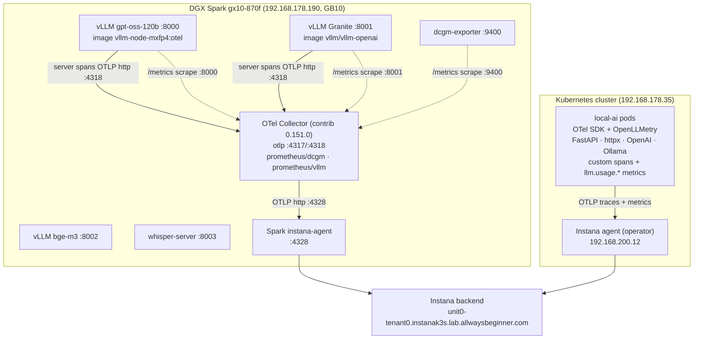

# local-ai — Monitoring & Observability Setup

Detailed reference for how the **local-ai** stack is monitored end-to-end with
**OpenTelemetry → Instana**. Covers the two telemetry paths (app in Kubernetes,
inference/GPU on the DGX Spark), every component, the data flows, ports, the
Instana entity layout, and an operational runbook.

> Companion docs: [`tracing.md`](tracing.md) (app-side span/metric code detail),
> [`architecture.md`](architecture.md) (app architecture), `ops/README.md`
> (Spark container run commands).

---

## 1. Goals

- **GenAI observability** — per-request LLM traces + token/latency metrics for
  every model call (Instana GenAI dashboard).
- **Inference observability** — vLLM server-side request spans + Prometheus
  metrics (throughput, KV-cache, queue depth) for the running model.
- **GPU observability** — DGX Spark GB10 GPU utilisation, temperature, power,
  clocks via NVIDIA DCGM.
- **App observability** — incoming HTTP (FastAPI), outgoing calls (httpx),
  pipeline stage timing.
- **Single backend** — everything lands in one Instana tenant.

---

## 2. Topology at a glance

Two independent telemetry paths converge on the same Instana backend:

| Path | Source | Ships via | Instana agent |
|------|--------|-----------|---------------|
| **A — Application** | `local-ai` pods (k8s cluster 192.168.178.35) | OTel SDK + OpenLLMetry, auto-instrumentation | operator-injected agent **192.168.200.12** |
| **B — Inference + GPU** | DGX Spark `gx10-870f` (192.168.178.190) | OTel Collector → local agent | Spark **instana-agent :4328** |

Why two paths: the app runs in Kubernetes where the **Instana operator** injects
an agent sidecar/host-agent automatically, so app traces go there. The Spark is a
**standalone box reporting via OpenTelemetry** (not a k8s node), so its inference
and GPU telemetry is funnelled through a local OTel Collector to a local Instana
agent.



---

## 3. Path A — Application telemetry (Kubernetes)

Implemented in [`src/local_ai/tracing.py`](../src/local_ai/tracing.py), initialised
at startup in `app.py` **before** FastAPI so instrumentors hook in.

### 3.1 Configuration
`k8s/configmap.yaml`:
```
LOCAL_AI_OTEL_ENABLED:      "true"
LOCAL_AI_OTEL_ENDPOINT:     "http://192.168.178.190:4328"   # bootstrap; see note
LOCAL_AI_OTEL_SERVICE_NAME: "local-ai"
OTEL_RESOURCE_ATTRIBUTES:   "INSTANA_PLUGIN=genai"           # GenAI dashboard
TRACELOOP_LOGGING_ENABLED:  "true"
TRACELOOP_METRICS_ENABLED:  "true"
```
> **Runtime note:** when the Instana operator has injected an agent
> (`INSTANA_AGENT_HOST` present, e.g. `192.168.200.12`), `setup_tracing()` uses
> **that** agent's TracerProvider and sends metrics to
> `http://<agent>:4318/v1/metrics` — the configmap `:4328` value is only a
> fallback for local/dev runs. Confirmed live:
> `Using Instana TracerProvider (agent at 192.168.200.12)`.

### 3.2 Auto-instrumentation
| Library | Instrumentor | Traces |
|---------|-------------|--------|
| FastAPI | `FastAPIInstrumentor` | incoming HTTP requests |
| httpx | `HTTPXClientInstrumentor` | outgoing calls to Spark services |
| OpenAI SDK | `OpenAIInstrumentor` (traceloop / OpenLLMetry) | LLM calls with `gen_ai.*` attributes |
| Ollama | `OllamaInstrumentor` (traceloop) | Ollama-path LLM calls |

### 3.3 Custom spans
- `local_ai.pipeline` — one span tree per job: `pipeline.preprocess`,
  `pipeline.transcribe`, `pipeline.summarize`, `pipeline.merge`.
- `local_ai.summarizer`, `local_ai.text_improver` — per-LLM-call spans.

### 3.4 LLM metrics (`LLMMetrics`)
Emitted via an OTel MeterProvider (OTLP HTTP, flush every 15 s):

| Metric | Type | Meaning |
|--------|------|---------|
| `llm.usage.input_tokens` | gauge | prompt tokens (last request) |
| `llm.usage.output_tokens` | gauge | completion tokens |
| `llm.usage.total_tokens` | gauge | total |
| `llm.response.duration` | gauge | latency (ms) |
| `llm.request.count` | counter | cumulative requests |

Each is tagged with both OTel GenAI (`gen_ai.request.model`, `gen_ai.system`) and
Instana short names (`model_id`, `ai_system`, `service_name`) so the Instana
GenAI plugin can filter by model. Resource carries `INSTANA_PLUGIN=genai`.

---

## 4. Path B — Inference & GPU telemetry (DGX Spark)

### 4.1 OTel Collector
`otelcol-contrib` **0.151.0**, config host-mounted at
`/home/manfred/otel-collector-config.yaml` (image is distroless — edit the host
file, not `docker exec`).

**Receivers**
| Name | Listens / scrapes | Feeds |
|------|-------------------|-------|
| `otlp/receiver` | gRPC `:4317`, HTTP `:4318` | traces, metrics/app, logs |
| `prometheus/dcgm` | scrape `192.168.178.190:9400` /15s | metrics/gpu |
| `prometheus/vllm` | scrape `:8000` (gpt-oss) **and** `:8001` (granite) /15s | metrics/vllm |

**Processors:** `transform/genai_to_llm` (maps `gen_ai.*` → `llm.*` for vLLM's
native spans), `resource/instance_id`, `batch`.

**Exporter:** `otlphttp/instana` → `http://192.168.178.190:4328` (tls insecure).

**Pipelines**
```
traces:        otlp/receiver → transform/genai_to_llm, resource/instance_id, batch → otlphttp/instana
metrics/app:   otlp/receiver → batch → otlphttp/instana
metrics/gpu:   prometheus/dcgm → batch → otlphttp/instana
metrics/vllm:  prometheus/vllm → resource/vllm, batch → otlphttp/instana
logs:          otlp/receiver → batch → otlphttp/instana
```

### 4.2 vLLM server-side tracing
vLLM emits its own request spans (scheduling, queue + inference timing) via
`--otlp-traces-endpoint`. `vllm.tracing.get_span_exporter()` picks the exporter
from `OTEL_EXPORTER_OTLP_TRACES_PROTOCOL` (`grpc`→:4317 default, or
`http/protobuf`→:4318/v1/traces). We use **http/protobuf → :4318**.

| Model | Container | Image | Note |
|-------|-----------|-------|------|
| gpt-oss-120b (:8000, **default**) | `vllm-gpt-oss-cutlass` | `vllm-node-mxfp4:otel` | base CUTLASS build lacks an OTLP exporter → `:otel` tag = base + `opentelemetry-exporter-otlp-proto-http` |
| Granite 4.0-H-Small (:8001) | `vllm-granite-small` | `vllm/vllm-openai:latest` | stock image already bundles the exporter |

Run flags: `-e OTEL_EXPORTER_OTLP_TRACES_PROTOCOL=http/protobuf`,
`-e OTEL_SERVICE_NAME=vllm-gpt-oss-120b`,
`--otlp-traces-endpoint http://192.168.178.190:4318/v1/traces`. Full commands in
`ops/README.md`.

### 4.3 vLLM Prometheus metrics
Each vLLM `/metrics` exposes `vllm:*` — `num_requests_running/waiting`,
`kv_cache_usage_perc`, generation/prompt token counters, `estimated_flops_per_gpu`,
prefix-cache hits, and latency **histograms** (e2e, TTFT, inter-token). The
scrape job labels `:8000`→`service.name=vllm-gpt-oss-120b`,
`:8001`→`service.name=vllm-granite-small`; the stopped model just reports `up=0`.

> **Histogram caveat:** latency histograms split into `_sum/_count/_bucket` — no
> single percentile series, so percentile line-charts aren't cleanly chartable in
> one Instana widget. Token panels are cumulative counters (slope = throughput).

### 4.4 GPU metrics (DCGM)
`dcgm-exporter` `nvcr.io/nvidia/k8s/dcgm-exporter:3.3.5-3.4.1` on `:9400`, custom
CSV at `/home/manfred/dcgm/custom-dcgm-metrics.csv`.

**Exported (GB10):** GPU_UTIL, GPU_TEMP, MEMORY_TEMP, MEM_COPY_UTIL, ENC_UTIL,
DEC_UTIL, POWER_USAGE, SM_CLOCK, NVLINK_BANDWIDTH_TOTAL, TOTAL_ENERGY_CONSUMPTION,
PCIE_REPLAY_COUNTER, XID_ERRORS, VGPU_LICENSE_STATUS.

**NOT available on GB10** (unified LPDDR5X, partial DCGM support): FB_USED/FB_FREE
(no discrete VRAM — use host `memory.used`) and `DCGM_FI_PROF_*` (tensor/FP
profiling — needs a newer Blackwell-aware DCGM). For quantized-inference
visibility use the vLLM/GenAI layer instead.

---

## 5. Instana backend

- **Tenant:** `https://unit0-tenant0.instanak3s.lab.allwaysbeginner.com`
- **Monitored host:** `gx10-870f` (GB10 Grace Blackwell), reports via OpenTelemetry.
- **Entity types:** `oTelDcgm` (GPU), `oTelVLLM`, `oTelLLM` (GenAI app), `otelHost`,
  `otelProcess`, `oTelK8s*`, plus the k8s-agent app entities.
- **GPU metric IDs** (JSON editor): gauges →
  `metrics.gauges.<SCOPE>DCGM_FI_DEV_<FIELD>`, sums → `metrics.sums.<SCOPE>…`,
  SCOPE = `github.com/open-telemetry/opentelemetry-collector-contrib/receiver/prometheusreceiver/`.
- **"DGX Spark" dashboard:** 20 panels — 3 host (CPU, Mem, Load) + 10 GPU/DCGM +
  7 vLLM (KV-cache %, Requests Running/Waiting, Generation/Prompt Tokens, Est.
  FLOPs/GPU, Prefix-cache Hits).

---

## 6. Ports reference

| Port | Host | Service | Protocol |
|------|------|---------|----------|
| 4317 | Spark | OTel Collector OTLP | gRPC |
| 4318 | Spark | OTel Collector OTLP | HTTP (vLLM traces, app metrics) |
| 4328 | Spark | Instana agent OTLP | HTTP (collector → agent) |
| 4318 | 192.168.200.12 | Instana operator agent OTLP | HTTP (app path) |
| 8000 | Spark | vLLM gpt-oss-120b (default) | HTTP + `/metrics` |
| 8001 | Spark | vLLM Granite | HTTP + `/metrics` |
| 8002 | Spark | vLLM bge-m3 embeddings | HTTP |
| 8003 | Spark | whisper-server | HTTP |
| 9090 | Spark | GPU manager (model swap) | HTTP |
| 9400 | Spark | dcgm-exporter | HTTP `/metrics` |
| 13133 | Spark | Collector health_check | HTTP |

---

## 7. Operational runbook

### Health checks
```bash
# Spark Instana agent listening? (000 = DOWN)
curl -s -o /dev/null -w '%{http_code}\n' http://192.168.178.190:4328/

# Collector delivering to Instana? (want 0)
docker logs otel-collector --since 2m | grep -c 'connection refused'

# vLLM model serving?
curl -s -o /dev/null -w '%{http_code}\n' http://192.168.178.190:8000/health

# vLLM metrics exposed?
curl -s http://192.168.178.190:8000/metrics | grep '^vllm:' | head
```

### Restart procedures
```bash
docker start instana-agent          # boots ~35s → :4328 listens
docker restart otel-collector       # brief telemetry blip; reloads config
# vLLM gpt-oss recreate (with tracing) — see ops/recreate-gptoss-otel.sh
```

### Known issues / gotchas
- **Spark `instana-agent` is `restart=no`** → dies on every Spark reboot and
  must be `docker start`ed manually. It was silently **Exited 3 weeks** once
  (2026-06-08 → 06-30), dropping ALL Spark GPU/vLLM/trace data while app-side
  (via the k8s operator agent) kept working. Consider `unless-stopped`.
- **Collector fans everything through :4328** — if the agent is down, `traces` +
  all `metrics/*` pipelines fail (`connection refused` → `sending queue is full`
  → data rejected). Check the agent first when Spark data goes missing.
- **`prometheus/vllm` scrapes both :8000 and :8001** — only the running model
  reports; the stopped one logs a benign `up=0` scrape failure.
- **GB10 DCGM is partial** — no FB memory, no `PROF_*` tensor metrics.
- **Only one large LLM fits** the 128 GB unified memory at a time; the GPU
  manager swaps whisper/vLLM containers by profile.

---

## 8. Change log

- **2026-07-01** — Per the Instana GenAI doc (Layer 3), added a `resource/vllm`
  processor (`INSTANA_PLUGIN=vllm`, `vllm.entity.type=vllm`, `service.namespace=genai`,
  `server.address/port`) to the `metrics/vllm` pipeline so vLLM metrics form a
  first-class **`oTelVLLM`** entity. See [`instana-genai-vllm-monitoring.md`](instana-genai-vllm-monitoring.md).
- **2026-06-30** — Enabled vLLM **server-side tracing for gpt-oss** (default
  model) via `vllm-node-mxfp4:otel` + http/protobuf → :4318. Corrected Granite
  endpoint 4328→4318.
- **2026-06-30** — Discovered + restarted the Spark **instana-agent** (down 3
  weeks); all Spark telemetry restored.
- **2026-06-30** — `prometheus/vllm` scrape now covers **both** gpt-oss (:8000)
  and Granite (:8001) with per-model `service.name`.
- **2026-05-31** — Added vLLM Prometheus metrics + GPU DCGM pipeline; built the
  20-panel "DGX Spark" dashboard.
